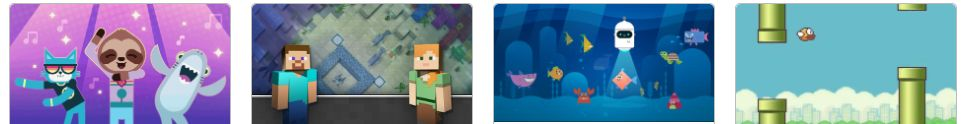

# For Beginners

You don't need to know how to program. We help children learn the basics with fun tools and tutorials.

### [Code.Org](Code_Org/)

Code.org created the Hour of Code, which helps teachers and community volunteers introduce millions of kids to Computer Science every year. Check out our recommendations of some of our favorite tutorials for kids anywhere from 5 to 12. 

### [Scratch](../GameDev/Scratch/) 

 

Scratch is fun way to program by dragging and dropping pieces and fitting them together. You can start with something simple like moving a character and build your way up to making really cool games.

Check out the [huge selection of Scratch tutorials](Scratch/) and learn how to earn one (or all) of our Scratch achievement badges.