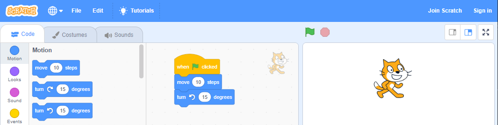
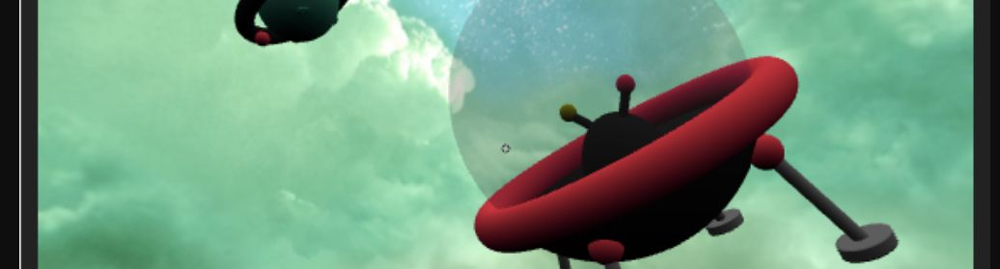
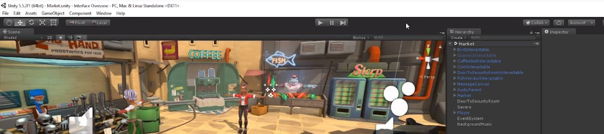

# Game Development

Do you want to make games? We have, can recommend, or are building modules in the following technologies. Most of these tutorials and tools are not created by CoderDojo, but our mentors can help you through them.

## Young Beginners

### [Scratch](Scratch/) 

 

Scratch is fun way to program by dragging and dropping pieces and fitting them together. You can start with something simple like moving a character and build your way up to making really cool games.

Check out the [huge selection of Scratch tutorials](Scratch/) and learn how to earn one (or all) of our Scratch achievement badges.

### [Intro to VR](VR-Intro/)

 

Take your skills to a new level with C3D. Using blocks and sprites, similar to Scratch, you'll start building 3D environments and games. Add a smartphone and a viewer and you can experience them in virtual reality. 

## Older Beginners and Young Intermediates

### [Unity](Unity/)

 

Unity is one of the leading engines for creating 2D, 3D, and Virtual Reality games. Free for personal and student use, we'll help you through their free online lessons and maybe a few more.

### more coming!

