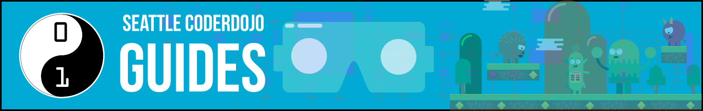

# Seattle CoderDojo Guides

## What are Guides?

Guides are modular exercises we have built ourselves, selected from online sources, or adapted from online sources.  Many can help our "Seekers" (visitors aged 8 - 18 who are learning with us) earn [Seattle CoderDojo Achievement Badges](!BADGES/).

## Guide Topics

* [Beginners](Beginners/)
  * First time coders (or coders who got one lesson a long time ago and forgot most of it)
* [Game Development](GameDev/)
  * Learn how to create games with a selection of technologies

**THIS IS AN "ALPHA" STAGE PROJECT:** We are just starting to build out our guide content. The list will grow. Check the Resources section below if you'd like to help make them.

## Resources

### Resources

* [Creating Modules](!CONTRIBUTING/)
* [How do badges work?](!BADGES/)

### Share this site: http://bit.ly/dojomods